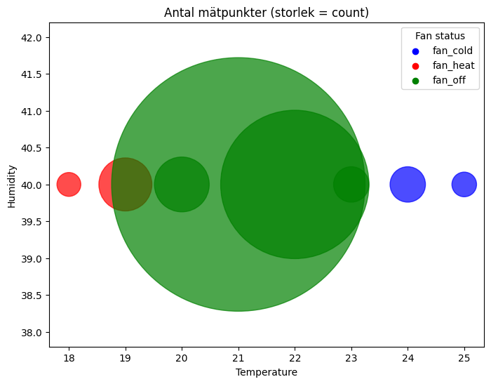
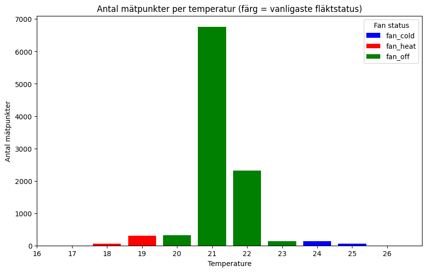

# AI IoT Kunskapskontroll 2: Intelligent Klimatkontroll 🌡️

Detta projekt är en del av kursen **AI och IoT** och syftar till att modellera ett komplett IoT-flöde från lokal datainsamling via sensorer till molnbaserad kommunikation, lagring och prediktiv analys med Machine Learning.

## 📋 Projektöversikt
Målet med projektet är att skapa ett intelligent system för rumsoptimering. Baserat på temperaturmätningar (augmenterade data) tränas en AI-modell för att förutsäga när en fläkt eller klimatanläggning behöver startas (förkonditionering) för att hålla rummet inom optimala gränser.

**Målvärden för rumsklimat:**
* **Temperatur:** $20^{\circ}C$ till $23^{\circ}C$
* **Luftfuktighet:** $< 60\%$

---

## 🛠️ Systemarkitektur & Material
Systemet följer ett strukturerat IoT-flöde:
1. **Edge-enhet:** Raspberry Pi Pico W.
2. **Programmering:** MicroPython.
3. **Kommunikation:** MQTT-protokollet via **HiveMQ Cloud** (Broker).
4. **Lagring:** Python-script (Subscriber) som lagrar data i en **CSV-fil**.
5. **Analys:** AI-modellering.

### Komponentlista
* 1x Raspberry Pi Pico W
* 1x Temperature & Humidity Module (DHT11/22)
* 1x RGB LED Module (för visuell status)
* 1x Large Microphone Module (användes i testfas)
* Kopplingsdäck (Breadboard) och Jumperkablar

---

## 🚀 Implementering

### 1. Datainsamling (Edge)
Inledningsvis genomfördes funktionstester för att säkerställa hårdvarans funktionalitet, inklusive "Hello World" (blinkande LED) och styrning av RGB-modulen på lite olika roliga sätt. 

För huvuduppgiften samlas data in med en **granularitet på varannan sekund**, med datum och tid, temperatur och luftfuktighet samt en klassificering (temp_status).  

### 2. EDA & Affärslogik
Den insamlade datan kategoriseras enligt följande regler:

**Temperaturkontroll:**
* $T < 20$ $\rightarrow$ Mode: `heat`
* $T > 23$ $\rightarrow$ Mode: `cool`
* $20 \le T \le 23$ $\rightarrow$ Mode: `off`

**Luftfuktighetskontroll:**
*Detta skippade vi för enkelhets skull*

### 3. AI-analys & Prediktion
För att förutse behovet av förkonditionering används en **RandomForest-modell**.
* **Data Augmentation:** Insamlade data har utökats för att ge modellen ett bredare träningsunderlag.
* **Mål:** Identifiera mönster i temperaturfall/stigning för att aktivera fläkt/värme innan gränsvärdena nås.

---

## 📊 Resultat 
Eftersom "problemet" var för enkelt så blev det ingen värst imponerande modell - eller kanske för imponerande modell som hade 100 % accuracy.

Trots detta får man anse att uppgiften är löst eftersom vi gått igenom alla steg och samlat in IoT-data, skickat dem via broker och subscriber, sparat i CSV-fil, tränat modell och predikterat data. 

 
---

## 📂 I Repository
* Koden för uppgiften.
* Insamlad data i CSV-format.
* Augmenterade data i CSV-format.
* Tränad RandomForest-modell och AI-script.
* `README.md` - Denna projektrapport.

**IoT-eliten:** Elin Molvig, My Tistelberg, Linus Staffas och Michael Broström
**Datum:** 21 april 2026
